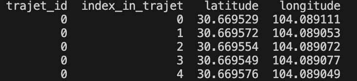

## Fichier volumineux

Pour télécharger le fichier de données, cliquez sur ce [lien Google Drive](https://drive.google.com/file/d/1v51VpohH0CcB3JW6D-BUc-1OgKdv1Jsh/view?usp=drive_link).

lien vers les données brute: [text](https://drive.google.com/drive/folders/1WLQ-JQar1_SteDY4zP2u6rzaIbq7v2l8)

trajet_id: Identifiant du trajet (chaque trajet complet a un ID unique). Ici, toutes les lignes que tu vois font partie du trajet n°0

index_in_trajet: Position du point dans le trajet. C’est un compteur d’étapes (0 = début du trajet, 1 = 2e point, etc.)

Latitude: Latitude du point GPS

Longitude: Longitude du point GPS
