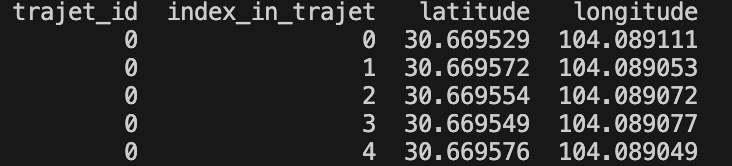

# dataTimNko
Création des data sets (Timothée Nikola)

trajet_id: Identifiant du trajet (chaque trajet complet a un ID unique). Ici, toutes les lignes que tu vois font partie du trajet n°0

index_in_trajet: Position du point dans le trajet. C’est un compteur d’étapes (0 = début du trajet, 1 = 2e point, etc.)

Latitude: Latitude du point GPS

Longitude: Longitude du point GPS
